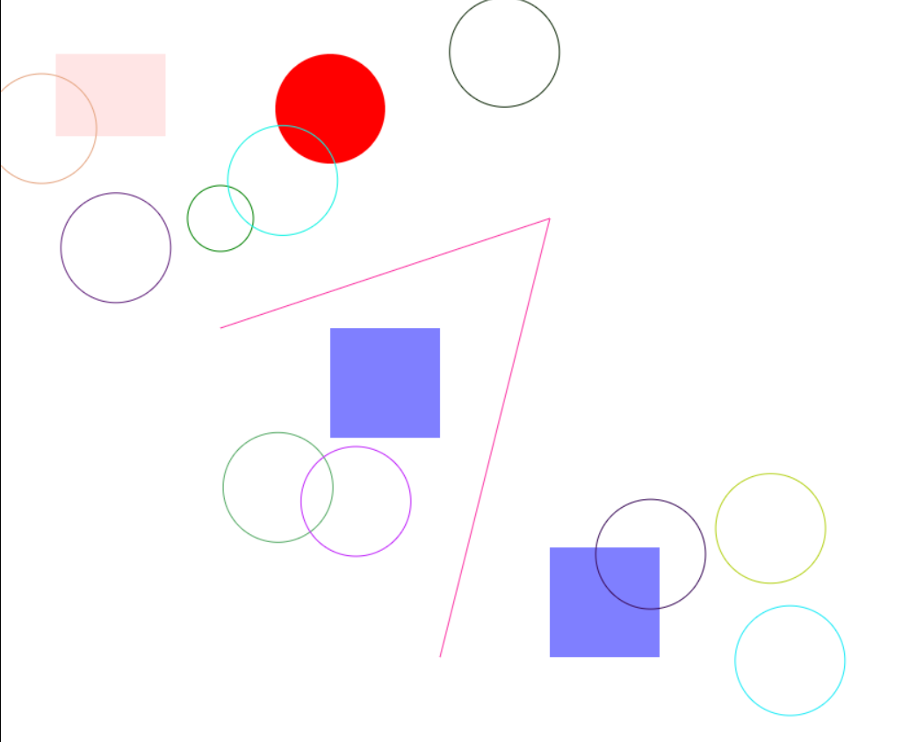
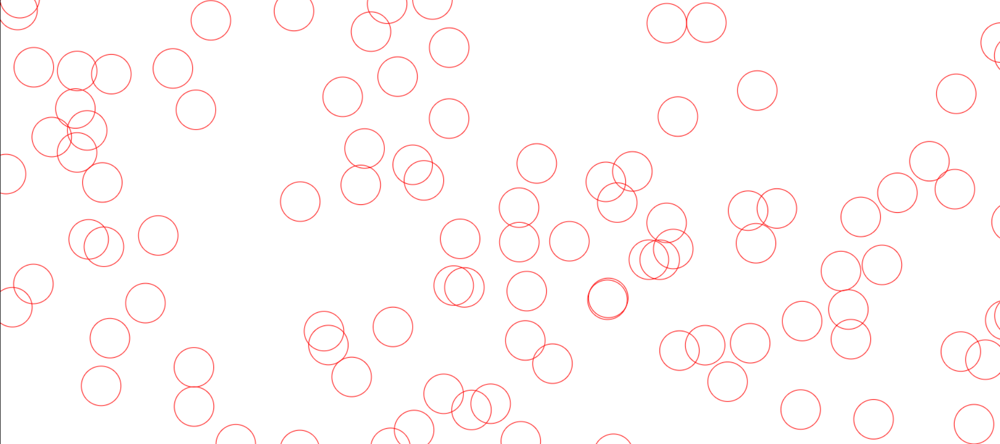
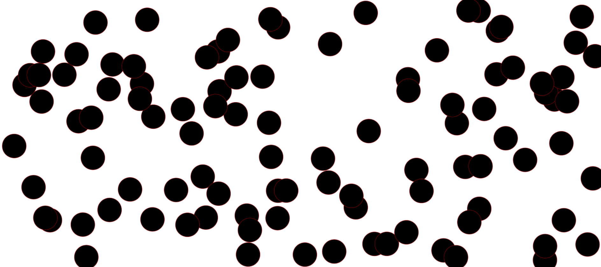

# HTML5_Canvas_API

<!--This is an example of what I have practiced while learning Html5 canvas API

 

This an example of animating circles (you can click on the image to open the animated video)

-->
